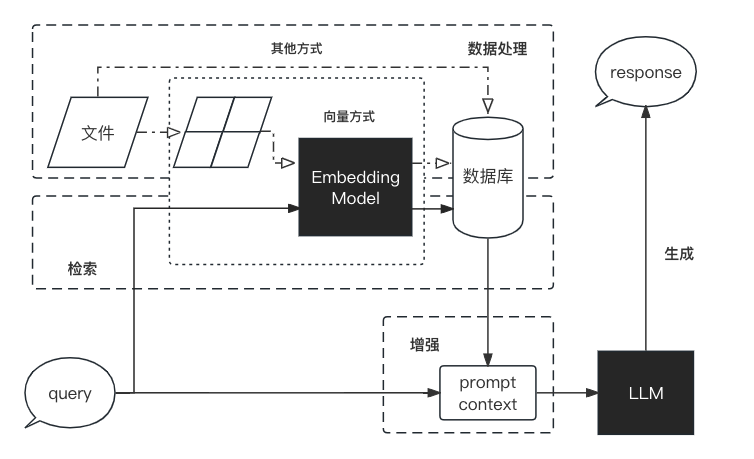

# 0x00 大语言模型简介

大语言模型（LLM，Large Language Model），也称大型语言模型，是一种旨在理解和生成人类语言的人工智能模型。

LLM 通常指包含数百亿（或更多）参数的语言模型，它们在海量的文本数据上进行训练，从而获得对语言深层次的理解。

## LLM的能力和特点

### 1. 涌现能力（emergent abilities）

区分大语言模型（LLM）与以前的预训练语言模型（PLM）最显著的特征之一是它们的 涌现能力 ，涌现能力在大型模型中特别突出，表现为模型性能随着规模增大而迅速提升，超过了随机水平，也就是我们常说的量变引起质变。

典型的涌现能力有三个

* 上下文学习：语言模型在提供自然语言指令或多个任务示例的情况下，通过理解上下文并生成相应输出的方式来执行任务。

* 指令遵循：通过使用自然语言描述的多任务数据进行微调，也就是所谓的 指令微调。

* 逐步推理：LLM 通过采用 思维链（CoT, Chain of Thought） 推理策略，利用包含中间推理步骤的提示机制来解决这些任务，从而得出最终答案。

### 2. 作为基座模型支持多元应用的能力

基座模型（foundation model）：一种全新的 AI 技术范式，借助于海量无标注数据的训练，获得可以适用于大量下游任务的大模型（单模态或者多模态）。这样，多个应用可以只依赖于一个或少数几个大模型进行统一建设。

### 3. 支持对话作为统一入口的能力

## 检索增强生成 RAG

检索增强生成（RAG, Retrieval-Augmented Generation）：一种新的模型架构，整合了从庞大知识库中检索到的相关信息，并以此为基础，指导大型语言模型生成更为精准的答案，从而显著提升了回答的准确性与深度。

目前LLM面临着的主要问题包含：

* 信息偏差/幻觉：LLM可能产生不准确信息，RAG通过检索数据源确保输出精确性和可信度。

* 知识更新滞后性：LLM基于静态数据集训练，RAG通过实时检索保持内容时效性和准确性。

* 内容不可追溯：LLM生成内容缺乏来源，RAG链接原始资料增强可追溯性，提升信任度。

* 领域专业知识能力欠缺：LLM在特定领域可能效果不佳，RAG检索相关文档提升专业回答质量。

* 推理能力限制：LLM面对复杂问题可能推理不足，RAG结合检索信息增强推理和理解能力。

* 应用场景适应性受限：LLM难以适应所有场景，RAG通过检索数据灵活适应多种应用场景。

* 长文本处理能力较弱：LLM受限于上下文窗口，RAG检索整合长文本，突破长度限制，提升效率。

### RAG的工作原理

RAG的工作流程可以简单地分为数据处理、检索、增强和生成四个阶段

1. 数据处理：

    * 清洗原始数据。
    * 转换数据为检索模型可用格式。
    * 存储数据至数据库。

2. 检索：
    * 输入用户问题，从数据库检索信息。

3. 增强：
    * 处理检索信息，优化生成模型理解。

4. 生成：
    * 输入增强信息至生成模型，产出答案。

    

### Why RAG? RAG 和 微调（Finetune）各有什么特点

| 特征比较 | RAG | 微调 |
| --- | --- | --- |
| 知识更新 | 直接更新知识库，成本低，适应动态数据 | 需重新训练，成本高，适合静态数据 |
| 外部知识 | 利用外部资源，适合文档和数据库 | 学习外部知识到内部 |
| 数据处理 | 低数据操作要求 | 依赖高质量数据集 |
| 模型定制 | 侧重信息检索，定制行为有限 | 可调行为、风格和领域知识 |
| 可解释性 | 可追溯数据源，可解释性高 | 黑盒子，可解释性低 |
| 计算资源 | 需资源支持检索和数据库 | 依赖训练数据集，资源要求高 |
| 推理延迟 | 检索步骤增加耗时 | LLM生成耗时 |
| 降低幻觉 | 真实信息生成，降低幻觉 | 学习领域数据减幻觉，但有局限 |
| 伦理隐私 | 外部数据引发伦理隐私问题 | 训练数据需处理敏感信息 |

### 使用 LangChain 开发 RAG 应用

LangChain框架是开源工具，旨在利用大型语言模型开发下游应用，提供通用接口简化开发。它支持数据感知和环境互动，连接语言模型与数据源，并实现模型与环境互动。

通过LangChain，可构建RAG应用。图中椭圆形代表LangChain模块（如数据收集、预处理），矩形代表数据状态（如原始数据、预处理数据），箭头指示数据流向。

> 阅读源文档获取更多内容
[LangChain](https://datawhalechina.github.io/llm-universe/#/C1/3.LangChain%20%E7%AE%80%E4%BB%8B)
