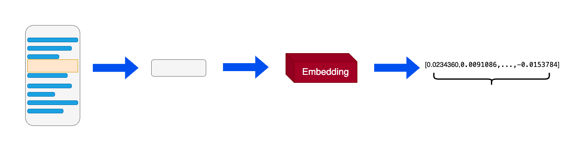
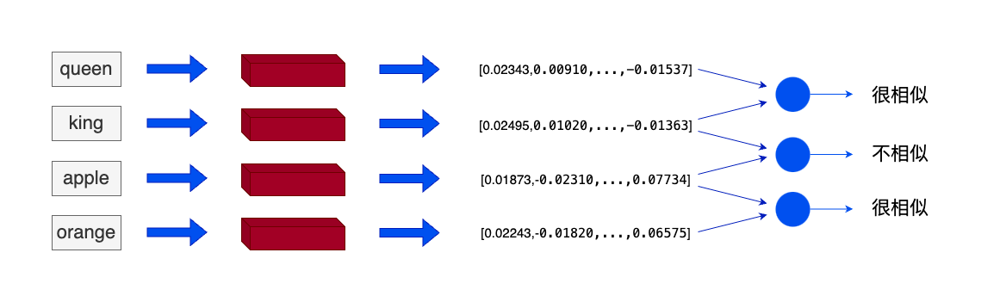

# 0x03 知识库的搭建

## 理解词向量及向量知识库

### 一、词向量

1. 什么是词向量

    在机器学习和自然语言处理（NLP）中，词向量（Embeddings）是一种将非结构化数据，如单词、句子或者整个文档，转化为实数向量的技术。

    

    嵌入背后的主要想法是，相似或相关的对象在嵌入空间（Embedding Space）中的距离应该很近。

    

    我们可以使用词嵌入（word embeddings）来表示文本数据。在词嵌入中，每个单词被转换为一个向量，这个向量捕获了这个单词的语义信息。含义相似的单词在嵌入空间中的位置将会非常接近。

2. 词向量的优势

    RAG（Retrieval Augmented Generation，检索增强生成）中词向量的两大优势：

    * 检索效率：词向量包含语义信息，可通过计算相似度指标（如点积、余弦距离）直接获取语义层面的匹配度，优于仅依赖关键词匹配的文字检索。
    * 跨模态能力：词向量能将文字、声音、图像等多种媒介通过向量模型统一映射，实现跨模态关联和查询，而传统数据库难以实现这一点。

### 二、向量数据库
